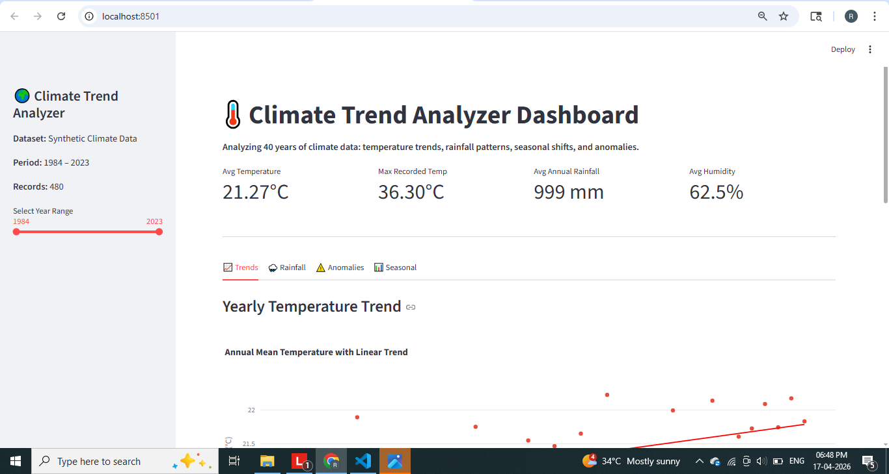

# 🌍 Climate Trend Analyzer

A Data Science project that analyzes long-term climate data (temperature, rainfall, humidity) to identify trends, detect anomalies, and predict future patterns.

---

## 🚀 Features

- Temperature trend analysis using Linear Regression  
- Anomaly detection using Z-score  
- Rainfall pattern analysis  
- Temperature forecasting  
- Interactive dashboard using Streamlit  

---

## 🛠 Tech Stack

- Python  
- Pandas, NumPy  
- Matplotlib, Seaborn, Plotly  
- Scikit-learn  
- Statsmodels  
- Streamlit  

---

## 📂 Project Structure

Climate-Trend-Analyzer/
├── data/
├── src/
├── app/
├── outputs/
├── images/
├── main.py
├── requirements.txt
└── README.md

---

## ⚙️Installation

git clone https://github.com/your-username/Climate-Trend-Analyzer.git

cd Climate-Trend-Analyzer
python -m venv climate_env
climate_env\Scripts\activate
pip install -r requirements.txt

---

## ▶️ Run Project

Run full pipeline:

python main.py

Run dashboard:

streamlit run app/streamlit_app.py

---

## Screenshots

Temperature Trend  

Rainfall Analysis  

Anomaly Detection  

Forecast  

Dashboard  

---

## 📌 Key Insights

- Temperature shows a gradual increasing trend  
- Extreme anomalies (heatwaves, floods) detected  
- Seasonal rainfall patterns observed  
- Future temperature trends predicted  

---

## 💡 Future Improvements

- Use real-world datasets  
- Add advanced models (ARIMA, LSTM)  
- Deploy as a web application 
